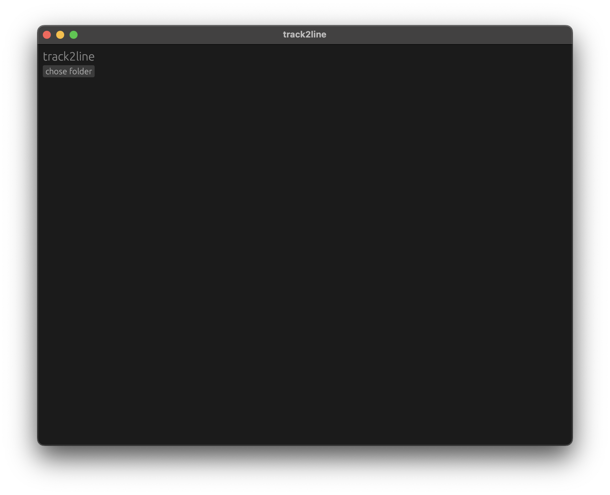
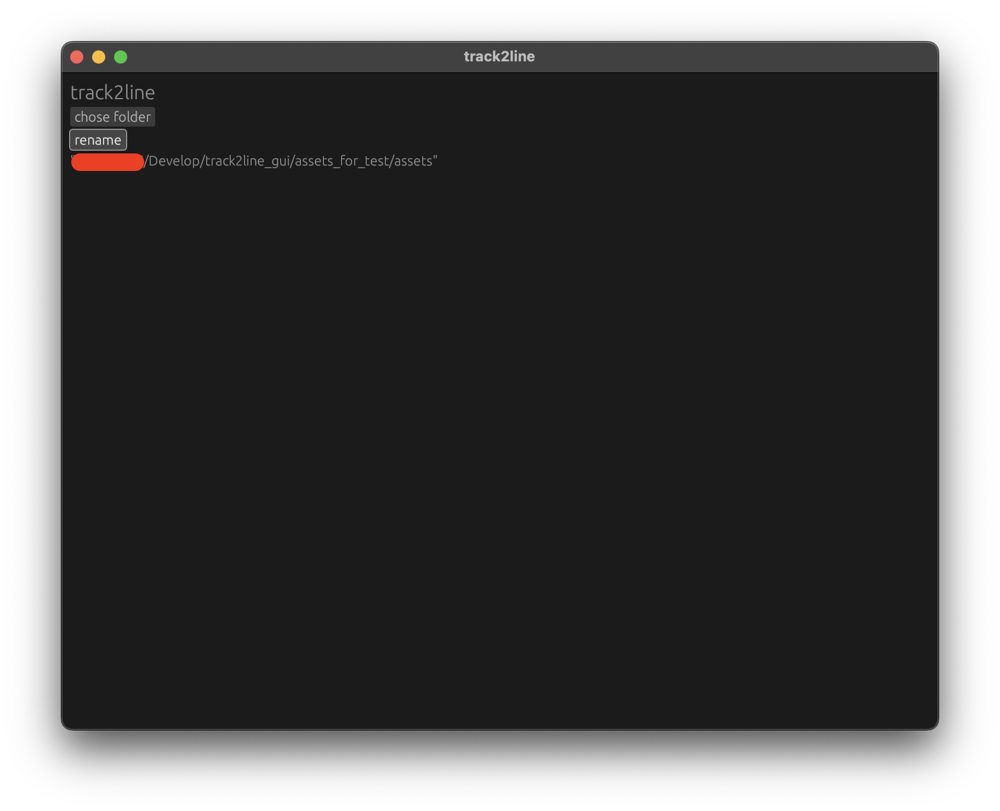
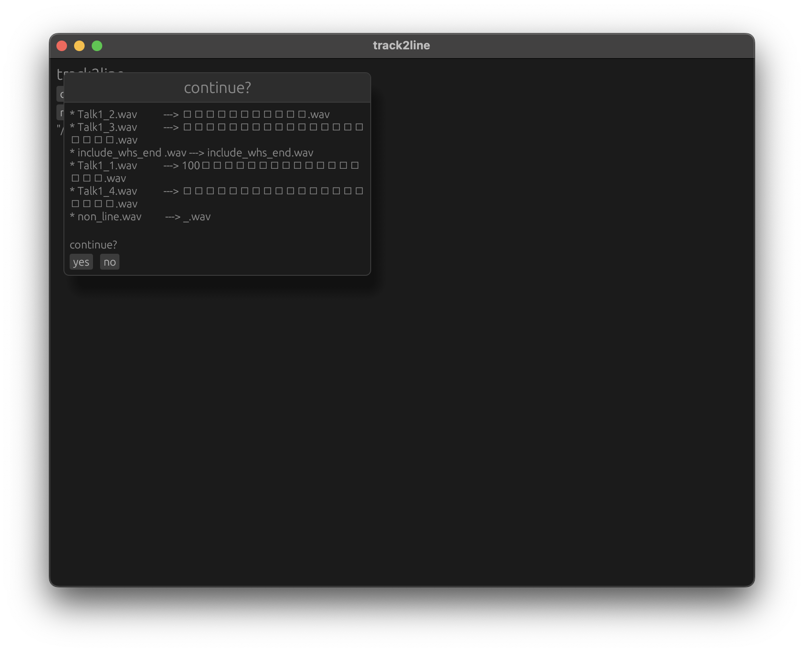

# Track2Line GUI

Track2Line GUI is a graphical user interface application for managing and renaming files in a specified directory. It is built using Rust and the `eframe` and `egui` libraries.

core functionality is composed of https://github.com/Uliboooo/track2line_lib.

## what's tool

this is tool that converts name of audio file provide by voisona talk, etc. by referring to a text file of the same name.

therefore, please check there points.

the names of the audio file and the text file must match.
the text file must contain the lines.(when lines is empty, insert "_" to name of the audio file.)

---

voisona talkなどで提供される音声ファイル名を、同名のテキストファイルを参照して変換するツールです。

そのため、以下の点をご確認ください。

音声ファイル名とテキストファイル名が一致していること。
テキストファイルに行が含まれていること(行が空の場合は音声ファイル名に「_」を挿入)

## usage

## Features

- Select a folder to manage files
- Rename files with specific extensions
- Confirmation dialog before renaming

## Prerequisites

- Rust (https://www.rust-lang.org/tools/install)

## Building

To build the project, run the following command:
